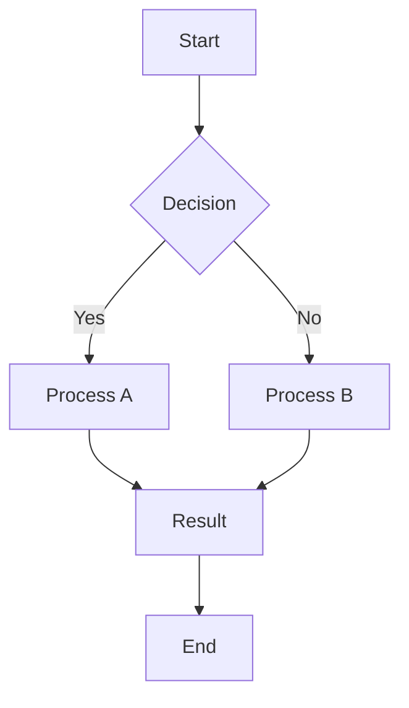
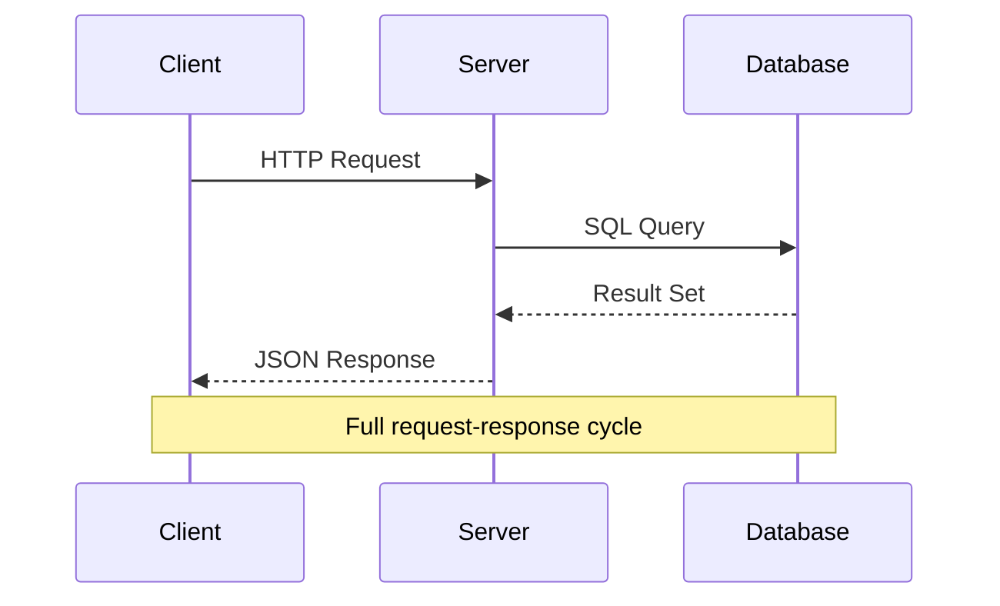

## Flowchart


```mermaid
graph TD
    A[Start] --> B{Decision}
    B -->|Yes| C[Process A]
    B -->|No| D[Process B]
    C --> E[Result]
    D --> E
    E --> F[End]
```

## Sequence Diagram


```mermaid
sequenceDiagram
    participant Client
    participant Server
    participant Database

    Client->>Server: HTTP Request
    Server->>Database: SQL Query
    Database-->>Server: Result Set
    Server-->>Client: JSON Response

    Note over Client,Database: Full request-response cycle
```

## Class Diagram

```mermaid
classDiagram
    class Animal {
        +String name
        +int age
        +makeSound() void
    }
    class Dog {
